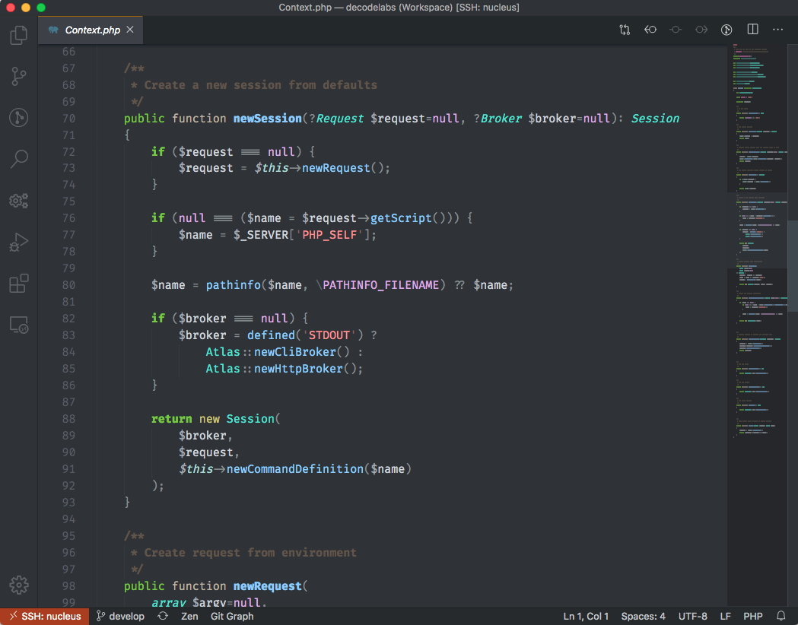
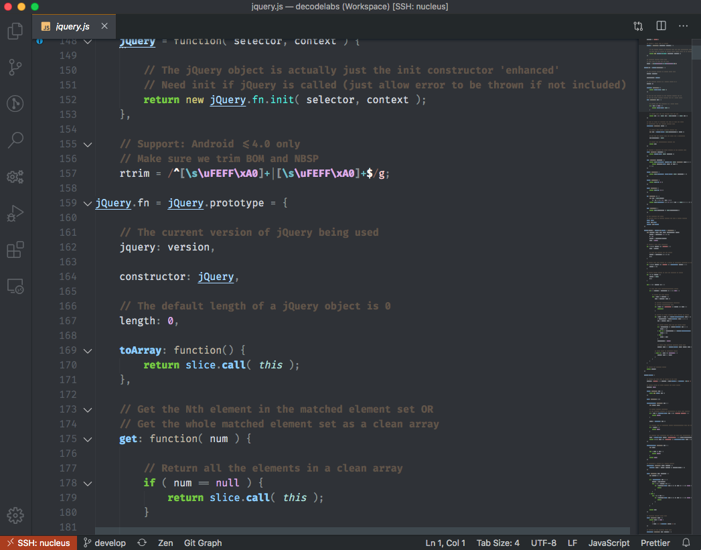
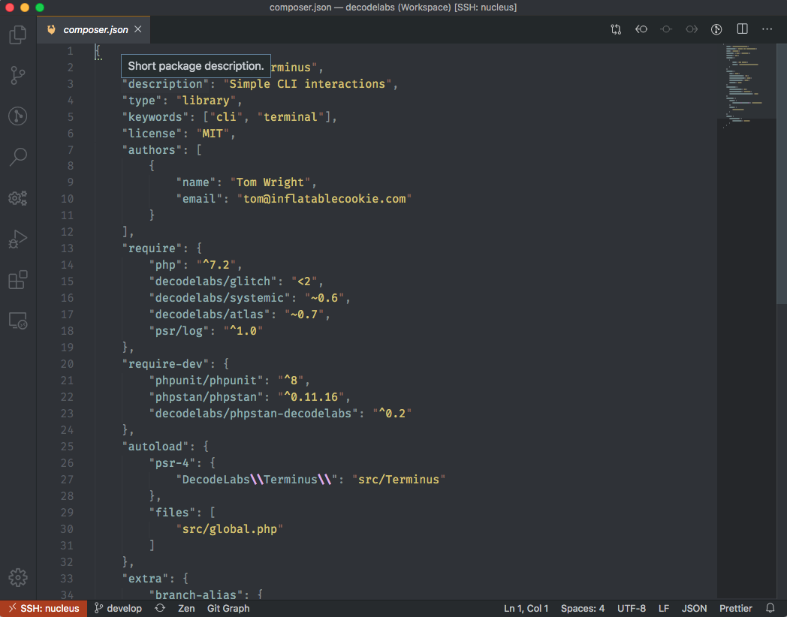
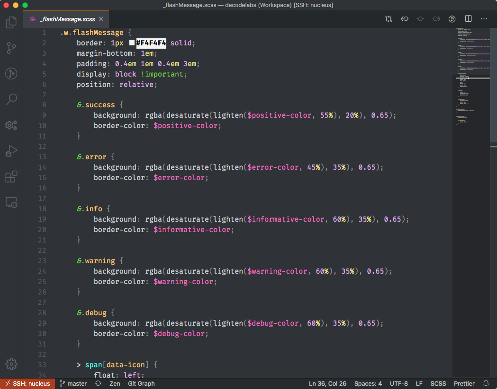
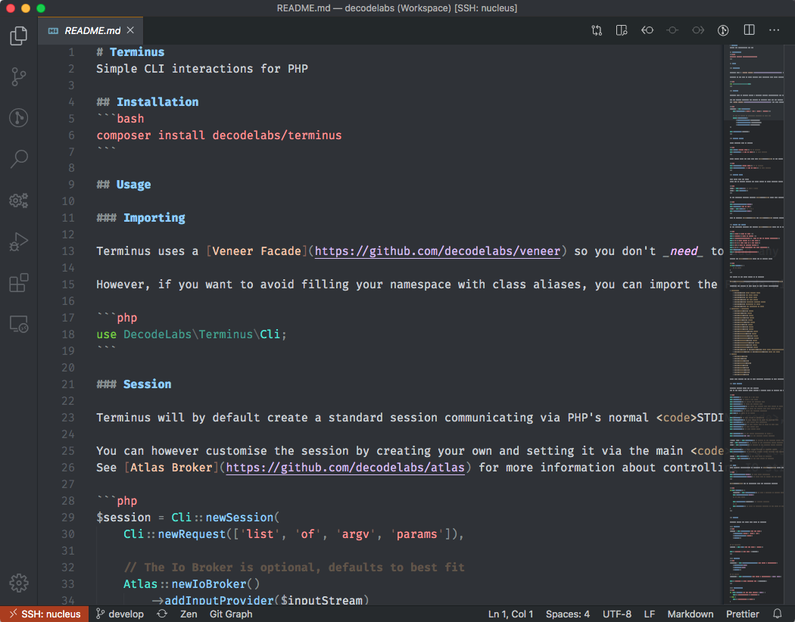

# Nucleus theme

Dark syntax theme for VS Code with focus on PHP and CSS.
Colours chosen to be easily distinguished and predictable but avoiding eye strain.

### With support for:

* PHP
* HTML
* CSS
* Less
* Sass
* Javascript
* JSON
* Yaml
* Neon
* Markdown
* Bash
* .env
* \+ more coming

## PHP

## Javascript

## JSON

## Sass

## Markdown

